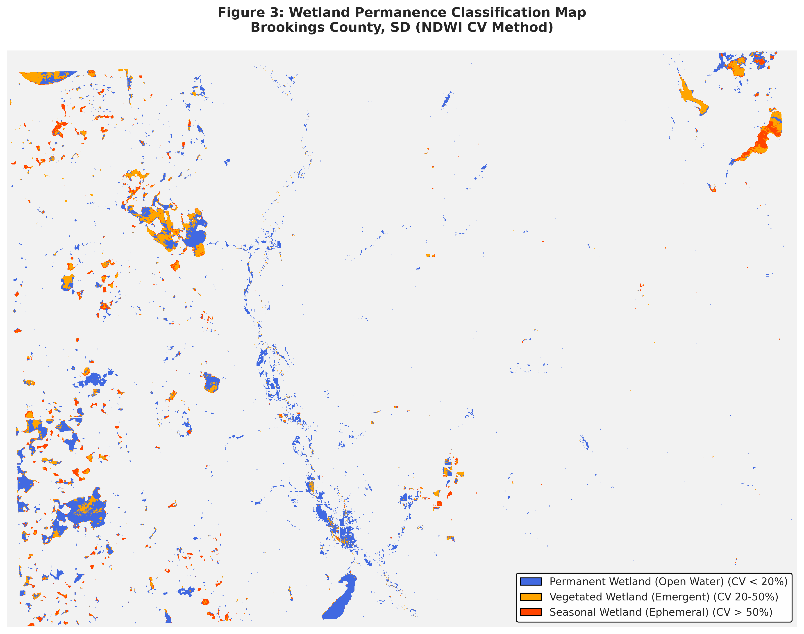

# Wetland Permanence Classification  
**Using Multi-Temporal Sentinel-2 Imagery**

**Author:** Image Bhattarai  
**Affiliation:** South Dakota State University  

---

## Overview
This project classifies wetland permanence using multi-temporal Sentinel-2 imagery.
The objective is to distinguish permanent, seasonal, and ephemeral wetlands using
spectral indices and temporal variability.

---

## Study Area
The study focuses on wetland systems analyzed using Sentinel-2 imagery acquired
across multiple seasons in Brookings County, SD.

---

## Methodology
1. Sentinel-2 image acquisition and preprocessing  
2. Calculation of spectral indices (NDWI, MNDWI)  
3. Multi-temporal compositing  
4. Permanence classification  
5. Accuracy assessment  

---

## Key Results

---

## Code
All analysis code is available in the repository.

---

## Contact
Email: image.bhattarai@jacks.sdstate.edu
